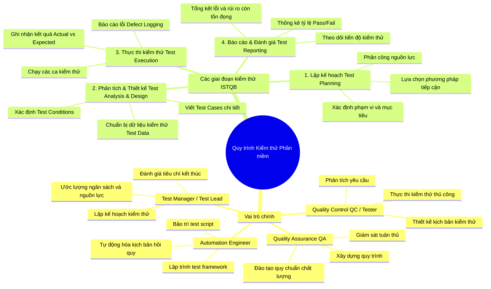

```mermaid
mindmap
  root((Quy trình Kiểm thử Phần mềm))
    Vai trò chính
      Quality Assurance QA
        Xây dựng quy trình
        Giám sát tuân thủ
        Đào tạo quy chuẩn chất lượng
      Quality Control QC / Tester
        Phân tích yêu cầu
        Thiết kế kịch bản kiểm thử
        Thực thi kiểm thử thủ công
      Automation Engineer
        Lập trình test framework
        Tự động hóa kịch bản hồi quy
        Bảo trì test script
      Test Manager / Test Lead
        Lập kế hoạch kiểm thử
        Ước lượng ngân sách và nguồn lực
        Đánh giá tiêu chí kết thúc
    Các giai đoạn kiểm thử ISTQB
      1. Lập kế hoạch Test Planning
        Xác định phạm vi và mục tiêu
        Lựa chọn phương pháp tiếp cận
        Phân công nguồn lực
      2. Phân tích & Thiết kế Test Analysis & Design
        Xác định Test Conditions
        Viết Test Cases chi tiết
        Chuẩn bị dữ liệu kiểm thử Test Data
      3. Thực thi kiểm thử Test Execution
        Chạy các ca kiểm thử
        Ghi nhận kết quả Actual vs Expected
        Báo cáo lỗi Defect Logging
      4. Báo cáo & Đánh giá Test Reporting
        Theo dõi tiến độ kiểm thử
        Thống kê tỷ lệ Pass/Fail
        Tổng kết lỗi và rủi ro còn tồn đọng
```